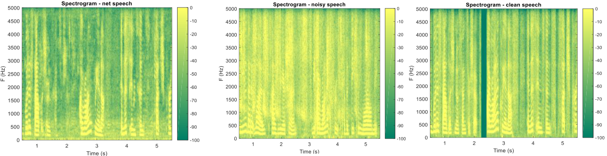

# Phase-Aware Speech Enhancement with TensorFlow 1.15

This repository contains a TensorFlow 1.15 implementation of a phase-aware speech enhancement model with deep complex U-Net by Choi et al [1]. The model, based on a 3D U-Net architecture, is designed to enhance the quality of speech signals.

[1] [https://openreview.net/pdf?id=SkeRTsAcYm](https://openreview.net/forum?id=SkeRTsAcYm).

The provided figure illustrates the speech enhancement for Babble noise.
 

## Table of Contents

- [Overview](#overview)
- [Requirements](#requirements)
- [Preparation](#preparation)
- [Training](#training)
- [Lisence](#lisence)

## Overview

The core architecture utilizes a U-Net with complex convolutions to process magnitude spectrograms of noisy speech signals, preserving both magnitude and phase information for improved speech quality.

The model suggests the use of Weighted Spectral Distance Ratio (WSDR) loss during training for enhanced performance in optimizing the model for speech enhancement tasks.

## Requirements

Ensure you have the following dependencies installed:

- Python 3.x
- TensorFlow 1.15
- Librosa
- NumPy
- SciPy 1.1.0
- sklearn

## Preparation
Modify the flag class in `config.py` to point to the relevant directories for noise and clean speech data. Adjust other parameters as needed for your specific setup.

### Model Training
- `LoadSavedModel`: Flag indicating whether to load a previously saved model.

### Model Parameters
- `channels`: Number of channels in the audio data.
- `threads`: Number of threads used during training.
- `epochs`: Number of training epochs.
- `batch_size`: Batch size for training.
- `validation_size`: Fraction of data used for validation.

### Audio Processing Parameters
- `stft_freq_samples`: Number of STFT (Short-Time Fourier Transform) frequency samples.
- `fs`: Sampling frequency of the audio data.
- `net_size`: Size of the neural network.
- `overlap`: Overlap factor for audio processing.
- `noverlap`: Non-overlapping samples based on the overlap factor.

### File Paths
- `check_name`: Checkpoint name for saving and loading models.
- `ckdir`: Directory for storing model checkpoints.
- `resultDir`: Directory for storing results.

### Data Directories
- `train_noise_dir`: Directory containing training noise data.
- `train_clean_dir`: Directory containing training clean speech data.

### Model Training Hyperparameters
- `regulizer_weight`: Regularization weight for preventing overfitting.
- `learning_rate`: Initial learning rate for training.
- `end_learning_rate`: Final learning rate for training.

## Training
Run the `main()` function in the provided Python script to initiate training. The model will be trained based on the specified configurations.

## Lisence
This project is licensed under the MIT License.
